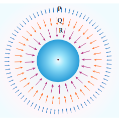
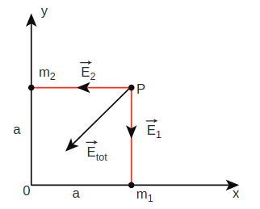
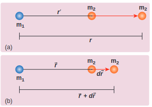

**6.2 GRAVITATIONAL FIELD AND GRAVITATIONAL POTENTIAL**

**6.2.1 Gravitational field**

Force is basically due to the interaction between two particles. Depending upon the type of interaction we can have two kinds of forces: Contact forces and Non-contact forces (Figure 6.8).

\

**Figure 6.8** Depiction of contact and non-contact forces

Contact forces are the forces applied where one object is in physical contact with the other. The movement of the object is caused by the physical force exerted through the contact between the object and the agent which exerts force.

Consider the case of Earth orbiting around the Sun. Though the Sun and the
Earth are not physically in contact with each other, there exists an interaction between them. This is because of the fact that the Earth experiences the gravitational force of the Sun. This gravitational force is a noncontact force.

It sounds mysterious that the Sun attracts the Earth despite being very far from it and without touching it. For contact forces like push or pull, we can calculate the strength of the force since we can feel or see. But how do we calculate the strength of non-contact force at different distances? To understand and calculate the strength of non-contact forces, the concept of 'field' is introduced.

The gravitational force on a particle of mass ' $\mathrm{m}_{2}$ ' due to a particle of mass ' $\mathrm{m}_{1}$ ' is

$$
\vec{F}_{21}=-\frac{G m_{1} m_{2}}{r^{2}} \hat{r}
$$

where $\hat{r}$ is a unit vector that points from $m_{1}$ to $m_{2}$ along the line joining the masses $m_{1}$ and $m_{2}$.

The gravitational field intensity $\vec{E}_{1}$ (here after called as gravitational field) at a point which is at a distance $r$ from $m_{1}$ is defined as the gravitational force experienced by unit mass placed at that point. It is given by the ratio $\frac{\vec{F}_{21}}{m_{2}}$ (where $m_{2}$ is the mass of the object on which $\vec{F}_{21}$ acts)

Using $\vec{E}_{1}=\frac{\vec{F}_{21}}{m_{2}}$ in equation (6.14) we get,

$$
\vec{E}_{1}=-\frac{G m_{1}}{r^{2}} \hat{r}
$$

$\vec{E}_{1}$ is a vector quantity that points towards the mass $m_{1}$ and is independent of mass $m_{2}$, Here $m_{2}$ is taken to be of unit magnitude. The unit $\hat{r}$ is along the line between $m_{1}$ and the point in question. The field $\vec{E}_{1}$ is due to the mass $m_{1}$.

In general, the gravitational field intensity due to a mass $M$ at a distance $r$ is given by

$$
\vec{E}=-\frac{G M}{r^{2}} \hat{r}
$$

Now in the region of this gravitational field, a mass ' $\mathrm{m}$ ' is placed at a point $\mathrm{P}$ (Figure 6.9). Mass ' $m$ ' interacts with the field $\vec{E}$ and experiences an attractive force due to $\mathrm{M}$ as shown in Figure 6.9. The gravitational force experienced by ' $\mathrm{m}$ ' due to ' $\mathrm{M}$ ' is given by

**Figure 6.9** Gravitational Field intensity measured with an object of unit mass

$$
\vec{F}_{m}=m \vec{E}
$$

Now we can equate this with Newton's second law $\vec{F}=m \vec{a}$

$$
\begin{aligned}
m \vec{a} & =m \vec{E} \\
\vec{a} & =\vec{E}
\end{aligned}
$$

In other words, equation (6.18) implies that the gravitational field at a point is equivalent to the acceleration experienced by a particle at that point. However, it is to be noted that $\vec{a}$ and $\vec{E}$ are separate physical quantities that have the same magnitude and direction. The gravitational field $\vec{E}$ is the property of the source and acceleration $\vec{a}$ is the effect experienced by the test mass (unit mass) which is placed in the gravitational field $\vec{E}$. The noncontact interaction between two masses can now be explained using the concept of "Gravitational field".

**Points to be noted:**

i) The strength of the gravitational field decreases as we move away from the mass $M$ as depicted in the Figure 6.10. The magnitude of $\vec{E}$ decreases as the distance $r$ increases.

**Figure 6.10** Strength of the Gravitational field lines decreases with distance

Figure 6.10 shows that the strength of the gravitational field at points $\mathrm{P}, \mathrm{Q}$, and $\mathrm{R}$ is given by $\left|\vec{E}_{P}\right|<\left|\vec{E}_{Q}\right|<\left|\vec{E}_{R}\right|$. It can be understood by comparing the length of the vectors at points $\mathrm{P}, \mathrm{Q}$, and $\mathrm{R}$.

ii) The "field" concept was introduced as a mathematical tool to calculate gravitational interaction. Later it was found that field is a real physical quantity and it carries energy and momentum in
space. The concept of field is inevitable in understanding the behavior of charges.

iii) The unit of gravitational field is Newton per kilogram $(\mathrm{N} / \mathrm{kg})$ or $\mathrm{m} \mathrm{s}^{-2}$.

**6.2.2 Superposition principle for Gravitational field**

**6.2.2 Superposition principle for Gravitational field**

Consider ' $n$ ' particles of masses $m_{1}, m_{2}, \ldots . m_{n}$, distributed in space at positions $\vec{r}_{1}, \vec{r}_{2}, \vec{r}_{3} \ldots$ etc, with respect to point $\mathrm{P}$. The total gravitational field at a point $\mathrm{P}$ due to all the masses is given by the vector sum of the gravitational field due to the individual masses (Figure 6.11). This principle is known as superposition of gravitational fields.

$$
\begin{aligned}
\vec{E}_{\text {total }} & =\vec{E}_{1}+\vec{E}_{2}+\ldots \vec{E}_{n} \\
& =-\frac{G m_{1}}{r_{1}^{2}} \hat{r}_{1}-\frac{G m_{2}}{r_{2}^{2}} \hat{r}_{2}-\ldots-\frac{G m_{n}}{r_{n}^{2}} \hat{r}_{n} \\
& =-\sum_{i=1}^{n} \frac{G m_{i}}{r_{i}^{2}} \hat{r}_{i} .
\end{aligned}
$$

**Figure 6.11** Superposition of two gravitational field intensities giving resultant field.

Instead of discrete masses, if we have continuous distribution of a total mass $M$, then the gravitational field at a point $\mathrm{P}$ is calculated using the method of integration. 

**EXAMPLE 6.3**

(a) Two particles of masses $m_{1}$ and $m_{2}$ are placed along the $\mathrm{x}$ and $\mathrm{y}$ axes respectively at a distance 'a' from the origin. Calculate the gravitational field at a point $\mathrm{P}$ shown in figure below.

**Solution**

Gravitational field due to $m_{1}$ at a point $\mathrm{P}$ is given by,

$$
\vec{E}_{1}=-\frac{G m_{1}}{a^{2}} \hat{j}
$$

Gravitational field due to $m_{2}$ at the point $\mathrm{p}$ is given by,

$$
\begin{gathered}
\vec{E}_{2}=-\frac{G m_{2}}{a^{2}} \hat{i} \\
\vec{E}_{\text {total }}=-\frac{G m_{1}}{a^{2}} \hat{j}-\frac{G m_{2}}{a^{2}} \hat{i} \\
=-\frac{G}{a^{2}}\left(m_{1} \hat{j}+m_{2} \hat{i}\right)
\end{gathered}
$$

The direction of the total gravitational field is determined by the relative value of $m_{1}$ and $m_{2}$.

When $m_{1}=m_{2}=m$

$$
\vec{E}_{\text {total }}=-\frac{G m}{a^{2}}(\hat{i}+\hat{j})
$$

$(\hat{i}+\hat{j}=\hat{j}+\hat{i}$ as vectors obeys commutation law).

$\vec{E}_{\text {total }}$ points towards the origin of the co-ordinate system and the magnitude of $\vec{E}_{\text {total }}$ is $\sqrt{2} \frac{G m}{a^{2}}$.

**EXAMPLE 6.4**

Qualitatively indicate the gravitational field of Sun on Mercury, Earth, and Jupiter shown in figure.

Since the gravitational field decreases as distance increases, Jupiter experiences a weak gravitational field due to the Sun. Since Mercury is the nearest to the Sun, it experiences the strongest gravitational field.

Solar System

**6.2.3 Gravitational Potential Energy**

The concept of potential energy and its physical meaning were dealt in unit 4 . The gravitational force is a conservative force and hence we can define a gravitational potential energy associated with this conservative force field.

Two masses $m_{1}$ and $m_{2}$ are initially separated by a distance $r^{\prime}$. Assuming $m_{1}$ to be fixed in its position, work must be done on $\mathrm{m}_{2}$ to move the distance from $r^{\prime}$ to $r$ as shown in Figure 6.12(a)

**Figure 6.12** Two distant masses changing the linear distance

To move the mass $m_{2}$ through an infinitesimal displacement $d \vec{r}$ from $\vec{r}$ to $\vec{r}+d \vec{r}$ (shown in the Figure 6.12(b)), work has to be done externally. This infinitesimal work is given by

$$
d W=\vec{F}_{e x t} \cdot d \vec{r}
$$

The work is done against the gravitational force, therefore,

$$
\left|\vec{F}_{e x t}\right|=\left|\vec{F}_{G}\right|=\frac{G m_{1} m_{2}}{r^{2}}
$$

Substituting Equation (6.22) in 6.21, we get

$$
d W=\frac{G m_{1} m_{2}}{r^{2}} \hat{r} \cdot d \vec{r}
$$

Also we know,

$$
\begin{aligned}
d \vec{r} & =d r \hat{r} \\
\Rightarrow d W & =\frac{G m_{1} m_{2}}{r^{2}} \hat{r} \cdot(d r \hat{r}) \\
\hat{r} \cdot \hat{r} & =1(\text { since both are unit vectors }) \\
\therefore \quad d W & =\frac{G m_{1} m_{2}}{r^{2}} d r
\end{aligned}
$$

Thus the total work done for displacing the particle from $r^{\prime}$ to $r$ is

$$
\begin{aligned}
& W=\int_{r^{\prime}}^{r} d W=\int_{r^{\prime}}^{r} \frac{G m_{1} m_{2}}{r^{2}} d r \\
& W=-\left(\frac{G m_{1} m_{2}}{r}\right)_{r^{\prime}}^{r} \\
& W=-\frac{G m_{1} m_{2}}{r}+\frac{G m_{1} m_{2}}{r^{\prime}} \\
& W=U(r)-U\left(r^{\prime}\right)
\end{aligned}
$$

where $U(r)=\frac{-G m_{1} m_{2}}{r}$

This work done $\mathrm{W}$ gives the gravitational potential energy difference of the system of masses $m_{1}$ and $m_{2}$ when the separation between them are $r$ and $r^{\prime}$ respectively.

**Case 1: If $\boldsymbol{r}<\boldsymbol{r}^{\prime}$**

Since gravitational force is attractive, $\mathrm{m}_{2}$ is attracted by $\mathrm{m}_{1}$. Then $\mathrm{m}_{2}$ can move from $r^{\prime}$ to $r$ without any external work (Figure 6.13(a)). Here work is done by the system spending its internal energy and hence the work done is said to be negative.

**Figure 6.13** Cases for calculation of work done by gravity

Case 2: If $r>r^{\prime}$

Work has to be done against gravity to move the object from $r^{\prime}$ to $r$ (Figure 6.13(b)). Therefore work is done on the body by external force and hence work done is positive.

It is to be noted that only potential energy difference has physical significance. Now gravitational potential energy can be discussed by choosing one point as the reference point.

Let us choose $r^{\prime}=\infty$. Then the second term in the equation (6.28) becomes zero.

$$
W=-\frac{G m_{1} m_{2}}{r}+0
$$

Now we can define gravitational potential energy of a system of two masses $m_{1}$ and $\mathrm{m}_{2}$ separated by a distance $r$ as the amount of work done to take the mass $m_{2}$ from a distance $r$ to infinity assuming $m_{1}$ to be fixed in its position and is written as $U(r)=-\frac{G m_{1} m_{2}}{r}$. It is to be noted that the gravitational potential energy of the system consisting of two masses $m_{1}$ and $\mathrm{m}_{2}$ separated by a distance $\mathrm{r}$, is the gravitational potential energy difference of the system when the masses are
separated by an infinite distance and by distance r. $U(r)=U(r)-U(\infty)$. Here we choose $U(\infty)=0$ as the reference point. The gravitational potential energy $U(r)$ is always negative because when two masses come together slowly from infinity, work is done by the system.

The unit of gravitational potential energy $U(r)$ is Joule and it is a scalar quantity. The gravitational potential energy depends upon the two masses and the distance between them.

**6.2.4 Gravitational potential energy near the surface of the Earth**

It is already discussed in chapter 4 that when an object of mass $m$ is raised to a height $h$, the potential energy stored in the object is mgh (Figure 6.14). This can be derived using the general expression for gravitational potential energy.

Figure 6.14 Mass placed at a distance $r$ from the center of the Earth

Consider the Earth and mass system, with $r$, the distance between the mass $m$ and the Earth's centre. Then the gravitational potential energy,

$$
U=-\frac{G M_{e} m}{r}
$$

Here $r=R_{e}+h$, where $R_{e}$ is the radius of the Earth. $h$ is the height above the Earth's surface

$$
U=-G \frac{M_{e} m}{\left(R_{e}+h\right)}
$$

If $h \ll<R_{e}$, equation (6.31) can be modified as

$$
\begin{aligned}
& U=-G \frac{M_{e} m}{R_{e}\left(1+h / R_{e}\right)} \\
& U=-G \frac{M_{e} m}{R_{e}}\left(1+h / R_{e}\right)^{-1}
\end{aligned}
$$

By using Binomial expansion and neglecting the higher order terms, we get

$$
U=-G \frac{M_{e} m}{R_{e}}\left(1-\frac{h}{R_{e}}\right)
$$

We know that, for a mass $m$ on the Earth's surface,

$$
G \frac{M_{e} m}{R_{e}}=m g R_{e}
$$

Substituting equation (6.34) in (6.33) we get,

$$
U=-m g R_{e}+m g h
$$

It is clear that the first term in the above expression is independent of the height h. For example, if the object is taken from
height $h_{1}$ to $h_{2}$, then the potential energy at $\mathrm{h}_{1}$ is

$$
U\left(h_{1}\right)=-m g R_{e}+m g h_{1}
$$

and the potential energy at $h_{2}$ is

$$
U\left(h_{2}\right)=-m g R_{e}+m g h_{2}
$$

The potential energy difference between $\mathrm{h}_{1}$ and $\mathrm{h}_{2}$ is

$$
U\left(h_{2}\right)-U\left(h_{1}\right)=m g\left(h_{2}-h_{1}\right) .
$$

The term $m g R_{e}$ in equations (6.36) and (6.37) plays no role in the result. Hence in the equation (6.35) the first term can be omitted or taken to zero. Thus it can be stated that The gravitational potential energy stored in the particle of mass $m$ at a height $h$ from the surface of the Earth is $U=m g h$. On the surface of the Earth, $U=0$, since h is zero.

It is to be noted that mgh is the work done on the particle when we take the mass $\mathrm{m}$ from the surface of the Earth to a height $\mathrm{h}$. This work done is stored as a gravitational potential energy in the mass $\mathrm{m}$. Even though $\mathrm{mgh}$ is gravitational potential energy of the system (Earth and mass $\mathrm{m}$ ), we can take $\mathrm{mgh}$ as the gravitational potential energy of the mass $m$ since Earth is stationary when the mass moves to height $h$.

**6.2.5 Gravitational potential V(r)**

It is explained in the previous sections that the gravitational field $\vec{E}$ depends only on the source mass which creates the field. It is a vector quantity. We can also define a scalar quantity called "gravitational potential" which depends only on the source mass.  

The gravitational potential at a distance $r$ due to a mass is defined as the amount of work required to take unit mass from the distance $r$ to infinity and it is denoted as $\mathrm{V}(\mathrm{r})$. In other words, the gravitational potential at distance $r$ is equivalent to gravitational potential energy per unit mass at the same distance $r$. It is a scalar quantity and its unit is $\mathrm{J} \mathrm{kg}^{-1}$

We can determine gravitational potential from gravitational potential energy. Consider two masses $\mathrm{m}_{1}$ and $\mathrm{m}_{2}$ separated by a distance $r$ which has gravitational potential energy $U(r)$ (Figure 6.15). The gravitational potential due to mass $m_{1}$ at a point $\mathrm{P}$ which is at a distance $\mathrm{r}$ from $\mathrm{m}_{1}$ is obtained by making $\mathrm{m}_{2}$ equal to unity $\left(\mathrm{m}_{2}=\right.$ $1 \mathrm{~kg})$. Thus the gravitational potential $V(r)$ due to mass $m_{1}$ at a distance $r$ is

$$
V(r)=-\frac{G m_{1}}{r}
$$

**Figure 6.15** Point mass placed at a distance

Gravitational field and gravitational force are vector quantities whereas the gravitational potential and gravitational potential energy are scalar quantities. The motion of particles can be easily analyzed using scalar quantities than vector quantities. Consider the example of a falling apple:

Figure 6.16 shows an apple which falls on Earth due to Earth's gravitational force. This can be explained using the concept of gravitational potential $V(r)$ as follows.

**Figure 6.16** Apple falling freely under gravity

The gravitational potential $V(r)$ at a point of height $h$ from the surface of the Earth is given by,

$$
V(r=R+h)=-\frac{G M_{e}}{(R+h)}
$$

The gravitational potential $V(r)$ on the surface of Earth is given by,

$$
V(r=R)=-\frac{G M_{e}}{R}
$$

Thus we see that

$$
V(r=R)<V(r=R+h) .
$$

It is already discussed in the previous section that the gravitational potential energy near the surface of the Earth at height $h$ is $m g h$. The gravitational potential at this point is simply $V(h)=U(h) / m=g h$. In fact, the gravitational potential on the surface of the Earth is zero since $h$ is zero. So the apple falls from a region of a higher gravitational potential to a region of lower gravitational potential. In general, the mass will move from a region of higher gravitational potential to a region of lower gravitational potential.

**EXAMPLE 6.5**

Water falls from the top of a hill to the ground. Why?

This is because the top of the hill is a point of higher gravitational potential than the surface of the Earth i.e. $V_{\text {hill }}>V_{\text {ground }}$

Water falling from hill top

The motion of particles can be analyzed more easily using scalars like $U(r)$ or $V(r)$ than vector quantities like $\vec{F}$ or $\vec{E}$. In modern theories of physics, the concept of potential plays a vital role.

**EXAMPLE 6.6**

Consider four masses $\mathrm{m}_{1}, \mathrm{~m}_{2}, \mathrm{~m}_{3}$, and $\mathrm{m}_{4}$ arranged on the circumference of a circle as shown in figure below

**Calculate**

(a) The gravitational potential energy of the system of 4 masses shown in figure.

(b) The gravitational potential at the point $\mathrm{O}$ due to all the 4 masses.

The gravitational potential energy $U(r)$ can be calculated by finding the sum of gravitational potential energy of each pair of particles.

$$
\begin{aligned}
U= & -\frac{G m_{1} m_{2}}{r_{12}}-\frac{G m_{1} m_{3}}{r_{13}}-\frac{G m_{1} m_{4}}{r_{14}} \\
& -\frac{G m_{2} m_{3}}{r_{23}}-\frac{G m_{2} m_{4}}{r_{24}}-\frac{G m_{3} m_{4}}{r_{34}}
\end{aligned}
$$

Here $r_{12}, r_{13} \ldots$ are distance between pair of particles

$$
\begin{aligned}
& r_{14}^{2}=R^{2}+R^{2}=2 R^{2} \\
& r_{14}=\sqrt{2} R=r_{12}=r_{23}=r_{34} \\
& r_{13}=r_{24}=2 R
\end{aligned}
$$

$$
\begin{aligned}
U= & -\frac{G m_{1} m_{2}}{\sqrt{2} R}-\frac{G m_{1} m_{3}}{2 R}-\frac{G m_{1} m_{4}}{\sqrt{2} R} \\
- & \frac{G m_{2} m_{3}}{\sqrt{2} R}-\frac{G m_{2} m_{4}}{2 R}-\frac{G m_{3} m_{4}}{\sqrt{2} R} \\
U=- & \frac{G}{R}\left[\frac{m_{1} m_{2}}{\sqrt{2}}+\frac{m_{1} m_{3}}{2}+\frac{m_{1} m_{4}}{\sqrt{2}}\right. \\
& \left.+\frac{m_{2} m_{3}}{\sqrt{2}}+\frac{m_{2} m_{4}}{2}+\frac{m_{3} m_{4}}{\sqrt{2}}\right]
\end{aligned}
$$

If all the masses are equal, then $m_{1}=m_{2}=m_{3}=m_{4}=M$

$$
\begin{aligned}
& U=-\frac{G M^{2}}{R}\left[\frac{1}{\sqrt{2}}+\frac{1}{2}+\frac{1}{\sqrt{2}}+\frac{1}{\sqrt{2}}+\frac{1}{2}+\frac{1}{\sqrt{2}}\right] \\
& U=-\frac{G M^{2}}{R}\left[1+\frac{4}{\sqrt{2}}\right]
\end{aligned}
$$

$$
U=-\frac{G M^{2}}{R}[1+2 \sqrt{2}]
$$

The gravitational potential $\mathrm{V}(\mathrm{r})$ at a point $\mathrm{O}$ is equal to the sum of the gravitational potentials due to individual mass. Since potential is a scalar, the net potential at point $\mathrm{O}$ is the algebraic sum of potentials due to each mass.

$$
\begin{aligned}
V_{O}(r) & =-\frac{G m_{1}}{R}-\frac{G m_{2}}{R}-\frac{G m_{3}}{R}-\frac{G m_{4}}{R} \\
\text { If } m_{1} & =m_{2}=m_{3}=m_{4}=M \\
V_{O}(r) & =-\frac{4 G M}{R}
\end{aligned}
$$