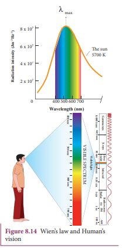
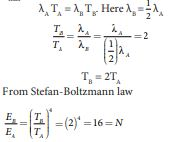

# LAWS OF HEAT TRANSFER

## Prevost theory of heat exchange

Every object emits heat radiations at all finite temperatures (except 0 K) as well as it absorbs radiations from the surroundings. For example, if you touch someone, they might feel your skin as either hot or cold.

A body at high temperature radiates more heat to the surroundings than it receives from it. Similarly, a body at a lower temperature receives more heat from the surroundings than it loses to it.

  

Prevost applied the idea of ‘thermal equilibrium’ to radiation. He suggested that all bodies radiate energy but hot bodies radiate more heat than the cooler bodies. At one point of time the rate of exchange of heat from both the bodies will become the same. Now the bodies are said to be in ‘thermal equilibrium’.

Only at absolute zero temperature a body will stop emitting. Therefore Prevost theory _states that all bodies emit thermal radiation at all temperatures above absolute zero irrespective of the nature of the surroundings._

## Stefan Boltzmann law

Stefan Boltzmann law states that, _the total amount of heat radiated per second per unit area of a black body is directly proportional to the fourth power of its absolute temperature._

 E \propto T^4  or  E = \sigma T^4 

Where, σ is known as Stefan’s constant. Its value is 5.67 \times 10^{-8} \, \text{W m}^{-2} \text{K}^{-4}

<blockquote style="background-color:pink; padding:10px; border-radius:5px;">

<!--  -->

<!--  -->

**Note** If a body is not a perfect black body, then
  E = \varepsilon \sigma T^4  
Where ‘e’ is emissivity of surface. _Emissivity is defined as the ratio of the energy radiated from a material’s surface to that radiated from a perfectly black body at the same temperature and wavelength._
</blockquote>

## Wien’s displacement law

In the universe every object emits radiation. The wavelengths of these radiations depend on the object’s absolute temperature. These  

radiations have different wavelengths and all the emitted wavelengths will not have equal intensity.

Wien’s law states that, _the wavelength of maximum intensity of emission of a black body radiation is inversely proportional to the absolute temperature of the black body._
\lambda \propto \frac{1}{T} 
 bT \propto 1 

Where, b is known as Wien’s constant. Its value is  2.898 \times 10^{-3} \, \text{m K} 
 It implies that if temperature of the body increases, maximal intensity wavelength ( λ_m_ ) shifts towards lower wavelength (higher frequency) of electromagnetic spectrum. It is shown in Figure 8.13 **Graphical representation**
 
<!--  -->

**Figure 8.13** Wien’s displacement law

From the graph it is clear that the peak of the wavelengths is inversely proportional to temperature. The curve is known as ‘black body radiation curve’.

**Wien’s law and Vision:** Why our eye is sensitive to only visible wavelength (in the range 400 nm to 700nm)?

The Sun is approximately taken as a black body. Since any object above 0 K will emit radiation, Sun also emits radiation. Its surface temperature is about 5700 K. By substituting this value in the equation (8.12),

 \lambda_m = \frac{b}{T} \approx \frac{2.898 \times 10^{-3}}{5700} \, \text{nm} 

It is the wavelength at which maximum intensity is 508_nm_. Since the Sun’s temperature is around 5700K, the spectrum of radiations emitted by Sun lie between 400 nm to 700 nm which is the visible part of the spectrum. It is shown in Figure 8.14

<!--  -->

The humans evolved under the Sun by receiving its radiations. The human eye is sensitive only in the visible not in infrared or X-ray ranges in the spectrum. Suppose if humans had evolved in a planet near the star Sirius (9940K), then they would have had the ability to see the Ultraviolet rays!

**EXAMPLE 8.9**

The power radiated by a black body A is EA and the maximum energy radiated was at the wavelength \lambda_A. The power radiated by another black body B is E_B = N E_A a
and the radiated energy was at the maximum wavelength, 2\lambda_A. What is the value of N?

According to Wien’s displacement law λmax T = constant for both object A and B

<!--  -->

Object B has emitted at lower wavelength compared to A. So the object B would have emitted more energetic radiation than A.